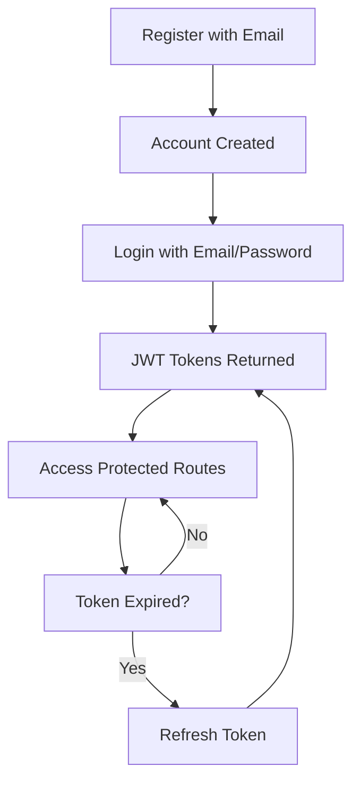
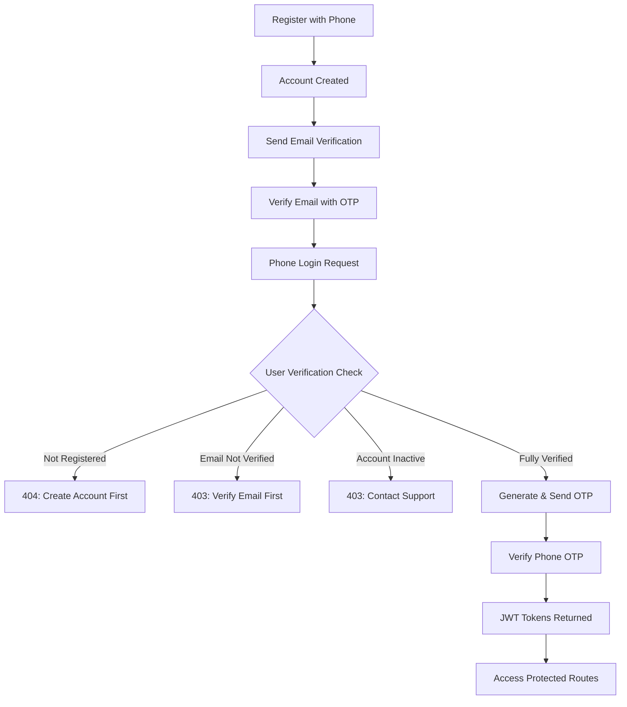
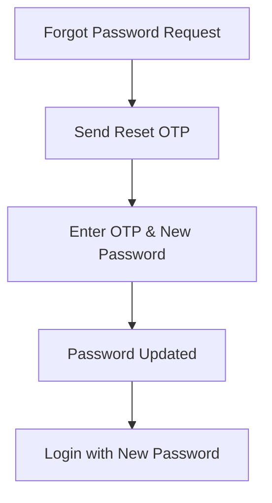

# 🔐 Auth Module API Documentation

## Overview
This document provides comprehensive documentation for the Authentication Module API endpoints, covering all authentication flows, user management, and security features.

**Base URL**: `http://localhost:3000/api/v1/auth`

## 🔄 Authentication Flow Overview

### 1. Standard Email/Username Authentication


### 2. Phone-Based Authentication with Email Verification


### 3. Password Reset Flow


---

## 📚 Table of Contents
1. [User Registration](#1-user-registration)
2. [Email/Username Login](#2-emailusername-login) 
3. [Phone Login](#3-phone-login)
4. [OTP Verification](#4-otp-verification)
5. [Email Verification](#5-email-verification)
6. [Forgot Password](#6-forgot-password)
7. [Reset Password](#7-reset-password)
8. [Refresh Token](#8-refresh-token)
9. [Logout](#9-logout)
10. [Development/Debug Endpoints](#10-developmentdebug-endpoints)
11. [Error Responses Reference](#11-error-responses-reference)
12. [Authentication Headers](#12-authentication-headers)
13. [Testing Guide](#13-testing-guide)

---

## 1. User Registration

### Endpoint
**POST** `/api/v1/auth/register`

### Description
Register a new user account. Creates the user profile but requires separate login to receive JWT tokens.

### Request Headers
```
Content-Type: application/json
```

### Request Body
```json
{
  "email": "john.doe@example.com",
  "username": "johndoe",
  "firstName": "John",
  "lastName": "Doe",
  "password": "SecurePassword123!",
  "phone": "+919876543210",
  "role": "student"
}
```

### Request Fields
| Field | Type | Required | Validation | Description |
|-------|------|----------|------------|-------------|
| email | string | Yes | Valid email format | Must be unique |
| username | string | Yes | Min 3 characters | Must be unique |
| firstName | string | Yes | Min 2 characters | User's first name |
| lastName | string | Yes | Min 2 characters | User's last name |
| password | string | Yes | 8+ chars, 1 upper, 1 lower, 1 number | Strong password |
| phone | string | No | Valid phone format | Required for phone login |
| role | string | No | 'student' or 'instructor' | Defaults to 'student' |

### Success Response (201 Created)
```json
{
  "success": true,
  "message": "User registered successfully. Please log in to get access tokens.",
  "data": {
    "user": {
      "id": "550e8400-e29b-41d4-a716-446655440000",
      "email": "john.doe@example.com",
      "username": "johndoe",
      "firstName": "John",
      "lastName": "Doe",
      "phone": "+919876543210",
      "role": "student",
      "isActive": true,
      "isEmailVerified": false,
      "createdAt": "2025-01-01T00:00:00.000Z",
      "updatedAt": "2025-01-01T00:00:00.000Z"
    }
  }
}
```

### Error Responses
- **400 Bad Request**: Validation errors, duplicate email/username
- **500 Internal Server Error**: Database errors

---

## 2. Email/Username Login

### Endpoint
**POST** `/api/v1/auth/login`

### Description
Authenticate user with email/username and password. Returns JWT access and refresh tokens.

### Request Headers
```
Content-Type: application/json
```

### Request Body Options

#### Option 1: Email Login
```json
{
  "email": "john.doe@example.com",
  "password": "SecurePassword123!"
}
```

#### Option 2: Username Login
```json
{
  "username": "johndoe",
  "password": "SecurePassword123!"
}
```

### Request Fields
| Field | Type | Required | Description |
|-------|------|----------|-------------|
| email | string | Yes* | Valid email address |
| username | string | Yes* | Username |
| password | string | Yes | User's password |

*Either email or username is required

### Success Response (200 OK)
```json
{
  "success": true,
  "message": "Login successful",
  "data": {
    "user": {
      "id": "550e8400-e29b-41d4-a716-446655440000",
      "email": "john.doe@example.com",
      "username": "johndoe",
      "firstName": "John",
      "lastName": "Doe",
      "phone": "+919876543210",
      "role": "student",
      "isActive": true,
      "isEmailVerified": false
    },
    "tokens": {
      "accessToken": "eyJhbGciOiJIUzI1NiIsInR5cCI6IkpXVCJ9...",
      "refreshToken": "eyJhbGciOiJIUzI1NiIsInR5cCI6IkpXVCJ9...",
      "expiresIn": 3600
    }
  }
}
```

---

## 3. Phone Login

### Endpoint
**POST** `/api/v1/auth/phone-login`

### Description
Initiate phone-based login by sending OTP. Includes comprehensive user verification checks.

### Request Headers
```
Content-Type: application/json
```

### Request Body
```json
{
  "phone": "+919876543210"
}
```

### Request Fields
| Field | Type | Required | Validation | Description |
|-------|------|----------|------------|-------------|
| phone | string | Yes | Valid phone format | Phone number with country code |

### Success Response (200 OK)
```json
{
  "success": true,
  "message": "Phone number verified. OTP will be sent for login.",
  "data": {
    "otpSent": true,
    "otpId": "550e8400-e29b-41d4-a716-446655440000",
    "messageId": "sms-message-id-12345",
    "expiresIn": 300,
    "user": {
      "id": "550e8400-e29b-41d4-a716-446655440000",
      "firstName": "John",
      "lastName": "Doe",
      "phone": "+919876543210"
    }
  }
}
```

### Error Responses
- **404 Not Found**: Phone number not registered
- **403 Forbidden**: Email not verified or account inactive
- **500 Internal Server Error**: SMS sending failed

### Specific Error Codes
```json
// Phone not registered
{
  "success": false,
  "error": {
    "message": "Phone number not registered. Please create an account first.",
    "code": "REGISTER"
  },
  "data": {
    "isRegistered": false,
    "actionRequired": "register"
  }
}

// Email not verified
{
  "success": false,
  "error": {
    "message": "Please verify your email address before using phone login.",
    "code": "EMAIL_VERIFICATION_REQUIRED"
  },
  "data": {
    "isRegistered": true,
    "isVerified": false,
    "actionRequired": "verify_email"
  }
}
```

---

## 4. OTP Verification

### Endpoint
**POST** `/api/v1/auth/verify-otp`

### Description
Verify OTP for phone login or password reset. Returns JWT tokens on successful login verification.

### Request Headers
```
Content-Type: application/json
```

### Request Body
```json
{
  "phone": "+919876543210",
  "otp": "123456",
  "type": "login"
}
```

### Request Fields
| Field | Type | Required | Validation | Description |
|-------|------|----------|------------|-------------|
| phone | string | Yes* | Valid phone format | Phone number |
| email | string | Yes* | Valid email format | Email address |
| otp | string | Yes | 6-digit number | OTP code |
| type | string | Yes | 'login' or 'password_reset' | Purpose of OTP |

*Either phone or email is required

### Success Response - Login (200 OK)
```json
{
  "success": true,
  "message": "OTP verification successful",
  "data": {
    "user": {
      "id": "550e8400-e29b-41d4-a716-446655440000",
      "email": "john.doe@example.com",
      "username": "johndoe",
      "firstName": "John",
      "lastName": "Doe",
      "phone": "+919876543210",
      "role": "student",
      "isActive": true,
      "isEmailVerified": true
    },
    "tokens": {
      "accessToken": "eyJhbGciOiJIUzI1NiIsInR5cCI6IkpXVCJ9...",
      "refreshToken": "eyJhbGciOiJIUzI1NiIsInR5cCI6IkpXVCJ9...",
      "expiresIn": 3600
    }
  }
}
```

### Success Response - Password Reset (200 OK)
```json
{
  "success": true,
  "message": "OTP verification successful",
  "data": {
    "verified": true,
    "canResetPassword": true,
    "user": {
      "id": "550e8400-e29b-41d4-a716-446655440000",
      "email": "john.doe@example.com",
      "username": "johndoe"
    }
  }
}
```

---

## 5. Email Verification

### 5.1 Send Email Verification OTP

#### Endpoint
**POST** `/api/v1/auth/send-email-verification`

#### Request Body
```json
{
  "email": "john.doe@example.com"
}
```

#### Success Response (200 OK)
```json
{
  "success": true,
  "message": "Email verification OTP sent successfully",
  "data": {
    "otpSent": true,
    "otpId": "550e8400-e29b-41d4-a716-446655440000",
    "expiresIn": 300
  }
}
```

### 5.2 Verify Email Address

#### Endpoint
**POST** `/api/v1/auth/verify-email`

#### Request Body
```json
{
  "email": "john.doe@example.com",
  "otp": "123456"
}
```

#### Success Response (200 OK)
```json
{
  "success": true,
  "message": "Email verified successfully. You can now use phone login.",
  "data": {
    "emailVerified": true,
    "user": {
      "id": "550e8400-e29b-41d4-a716-446655440000",
      "email": "john.doe@example.com",
      "username": "johndoe",
      "isEmailVerified": true
    }
  }
}
```

---

## 6. Forgot Password

### Endpoint
**POST** `/api/v1/auth/forgot-password`

### Description
Initiate password reset process by sending OTP to email or phone.

### Request Headers
```
Content-Type: application/json
```

### Request Body Options

#### Option 1: Email Reset
```json
{
  "email": "john.doe@example.com"
}
```

#### Option 2: Phone Reset
```json
{
  "phone": "+919876543210"
}
```

### Request Fields
| Field | Type | Required | Description |
|-------|------|----------|-------------|
| email | string | Yes* | Valid email address |
| phone | string | Yes* | Valid phone number |

*Either email or phone is required

### Success Response (200 OK)
```json
{
  "success": true,
  "message": "Password reset OTP sent successfully",
  "data": {
    "otpSent": true,
    "otpId": "550e8400-e29b-41d4-a716-446655440000",
    "sentTo": "email", // or "phone"
    "expiresIn": 300
  }
}
```

---

## 7. Reset Password

### Endpoint
**POST** `/api/v1/auth/reset-password`

### Description
Reset password using OTP verification.

### Request Headers
```
Content-Type: application/json
```

### Request Body
```json
{
  "email": "john.doe@example.com",
  "otp": "123456",
  "password": "NewSecurePassword123!",
  "confirmPassword": "NewSecurePassword123!"
}
```

### Request Fields
| Field | Type | Required | Validation | Description |
|-------|------|----------|------------|-------------|
| email | string | Yes* | Valid email format | Email address |
| phone | string | Yes* | Valid phone format | Phone number |
| otp | string | Yes | 6-digit number | Reset OTP |
| password | string | Yes | Strong password rules | New password |
| confirmPassword | string | No | Must match password | Password confirmation |

*Either email or phone is required

### Success Response (200 OK)
```json
{
  "success": true,
  "message": "Password reset successful",
  "data": {
    "passwordReset": true,
    "user": {
      "id": "550e8400-e29b-41d4-a716-446655440000",
      "email": "john.doe@example.com",
      "username": "johndoe"
    }
  }
}
```

---

## 8. Refresh Token

### Endpoint
**POST** `/api/v1/auth/refresh-token`

### Description
Refresh expired access token using refresh token.

### Request Headers
```
Content-Type: application/json
```

### Request Body
```json
{
  "refreshToken": "eyJhbGciOiJIUzI1NiIsInR5cCI6IkpXVCJ9..."
}
```

### Request Fields
| Field | Type | Required | Description |
|-------|------|----------|-------------|
| refreshToken | string | Yes | Valid refresh token |

### Success Response (200 OK)
```json
{
  "success": true,
  "message": "Token refreshed successfully",
  "data": {
    "tokens": {
      "accessToken": "eyJhbGciOiJIUzI1NiIsInR5cCI6IkpXVCJ9...",
      "refreshToken": "eyJhbGciOiJIUzI1NiIsInR5cCI6IkpXVCJ9...",
      "expiresIn": 3600
    },
    "user": {
      "id": "550e8400-e29b-41d4-a716-446655440000",
      "email": "john.doe@example.com",
      "username": "johndoe"
    }
  }
}
```

---

## 9. Logout

### Endpoint
**POST** `/api/v1/auth/logout`

### Description
Logout user and invalidate session tokens.

### Request Headers
```
Authorization: Bearer <access_token>
Content-Type: application/json
```

### Request Body Options

#### Option 1: Refresh Token in Body
```json
{
  "refreshToken": "eyJhbGciOiJIUzI1NiIsInR5cCI6IkpXVCJ9..."
}
```

#### Option 2: Access Token in Header Only
```json
{}
```

### Success Response (200 OK)
```json
{
  "success": true,
  "message": "Logout successful",
  "data": {
    "loggedOut": true,
    "tokensInvalidated": true
  }
}
```

---

## 10. Development/Debug Endpoints

### 10.1 Debug Configuration

#### Endpoint
**GET** `/api/v1/auth/debug-config`

#### Description
View current environment configuration (development only).

#### Success Response (200 OK)
```json
{
  "success": true,
  "data": {
    "environment": "development",
    "jwtConfig": {
      "expiresIn": "7d",
      "hasSecret": true
    },
    "emailConfig": {
      "hasApiKey": true,
      "sender": "noreply@edtech.com"
    },
    "smsConfig": {
      "hasApiKey": true,
      "sender": "EDTECH",
      "baseUrl": "https://2factor.in/API/V1"
    }
  }
}
```

### 10.2 Test 2Factor API

#### Endpoint
**GET** `/api/v1/auth/test-2factor-api`

#### Description
Test 2Factor SMS API connectivity.

#### Success Response (200 OK)
```json
{
  "success": true,
  "data": {
    "apiConnectivity": "SUCCESS",
    "responseStatus": 200,
    "responseData": {
      "Status": "Success",
      "Details": "d1f92917-bbdc-49a3-ad23-958b33160cc8"
    }
  },
  "message": "2Factor API connectivity test"
}
```

### 10.3 Test Phone Formatting

#### Endpoint
**POST** `/api/v1/auth/test-phone-formatting`

#### Request Body
```json
{
  "phone": "+919876543210"
}
```

#### Success Response (200 OK)
```json
{
  "success": true,
  "data": {
    "input": {
      "originalPhone": "+919876543210",
      "phoneLength": 13
    },
    "processing": {
      "cleanedPhone": "+919876543210",
      "isValid": true,
      "phoneForUrl": "919876543210"
    },
    "validation": {
      "passes": true,
      "phoneRegex": "^\\+91[6-9]\\d{9}$"
    }
  }
}
```

### 10.4 Debug SMS Sending

#### Endpoint
**POST** `/api/v1/auth/debug-sms-send`

#### Request Body
```json
{
  "phone": "+919876543210",
  "message": "Test SMS from EdTech"
}
```

#### Success Response (200 OK)
```json
{
  "success": true,
  "data": {
    "apiCall": {
      "success": true,
      "httpStatus": 200,
      "response": {
        "Status": "Success",
        "Details": "session-id-12345"
      },
      "phone": "919876543210",
      "message": "Test SMS from EdTech"
    }
  },
  "message": "SMS API debugging completed"
}
```

---

## 11. Error Responses Reference

### Standard Error Format
```json
{
  "success": false,
  "error": {
    "message": "Error description",
    "code": "ERROR_CODE",
    "details": ["Additional error details"]
  }
}
```

### Common Error Codes

| HTTP Status | Error Code | Description |
|-------------|------------|-------------|
| 400 | VALIDATION_ERROR | Request validation failed |
| 401 | INVALID_CREDENTIALS | Login credentials incorrect |
| 401 | INVALID_OTP | OTP verification failed |
| 401 | TOKEN_EXPIRED | Access token expired |
| 401 | INVALID_TOKEN | Invalid or malformed token |
| 403 | EMAIL_VERIFICATION_REQUIRED | Email verification needed |
| 403 | ACCOUNT_INACTIVE | User account deactivated |
| 404 | USER_NOT_FOUND | User does not exist |
| 404 | REGISTER | Phone/email not registered |
| 409 | EMAIL_EXISTS | Email already registered |
| 409 | USERNAME_EXISTS | Username already taken |
| 429 | RATE_LIMIT_EXCEEDED | Too many requests |
| 500 | SMS_SEND_FAILED | SMS delivery failed |
| 500 | OTP_GENERATION_FAILED | OTP generation error |

---

## 12. Authentication Headers

### For Protected Endpoints
```
Authorization: Bearer <access_token>
Content-Type: application/json
```

### JWT Token Structure
```javascript
// Access Token Payload
{
  "userId": "550e8400-e29b-41d4-a716-446655440000",
  "email": "john.doe@example.com",
  "username": "johndoe",
  "role": "student",
  "iat": 1640995200,
  "exp": 1640998800
}
```

---

## 13. Testing Guide

### 13.1 Complete Authentication Flow Test

#### Step 1: Register User
```bash
POST /api/v1/auth/register
{
  "email": "test@example.com",
  "username": "testuser",
  "firstName": "Test",
  "lastName": "User",
  "password": "TestPass123!",
  "phone": "+919876543210"
}
```

#### Step 2: Login with Email
```bash
POST /api/v1/auth/login
{
  "email": "test@example.com",
  "password": "TestPass123!"
}
```

#### Step 3: Verify Email for Phone Login
```bash
POST /api/v1/auth/send-email-verification
{
  "email": "test@example.com"
}

POST /api/v1/auth/verify-email
{
  "email": "test@example.com",
  "otp": "123456"
}
```

#### Step 4: Phone Login
```bash
POST /api/v1/auth/phone-login
{
  "phone": "+919876543210"
}

POST /api/v1/auth/verify-otp
{
  "phone": "+919876543210",
  "otp": "123456",
  "type": "login"
}
```

### 13.2 Postman Collection Setup

#### Environment Variables
```json
{
  "baseUrl": "http://localhost:3000/api/v1",
  "accessToken": "",
  "refreshToken": "",
  "userId": "",
  "testEmail": "test@example.com",
  "testPhone": "+919876543210"
}
```

#### Pre-request Scripts
```javascript
// Auto-set Authorization header
if (pm.environment.get("accessToken")) {
    pm.request.headers.add({
        key: "Authorization",
        value: "Bearer " + pm.environment.get("accessToken")
    });
}
```

#### Post-response Scripts
```javascript
// Save tokens from login responses
if (pm.response.json() && pm.response.json().data && pm.response.json().data.tokens) {
    pm.environment.set("accessToken", pm.response.json().data.tokens.accessToken);
    pm.environment.set("refreshToken", pm.response.json().data.tokens.refreshToken);
}

// Save user ID
if (pm.response.json() && pm.response.json().data && pm.response.json().data.user) {
    pm.environment.set("userId", pm.response.json().data.user.id);
}
```

### 13.3 Common Test Scenarios

#### Password Reset Flow
```bash
# 1. Request reset
POST /api/v1/auth/forgot-password
{"email": "test@example.com"}

# 2. Reset with OTP
POST /api/v1/auth/reset-password
{
  "email": "test@example.com",
  "otp": "123456",
  "password": "NewPassword123!",
  "confirmPassword": "NewPassword123!"
}

# 3. Login with new password
POST /api/v1/auth/login
{
  "email": "test@example.com",
  "password": "NewPassword123!"
}
```

#### Token Refresh Flow
```bash
# 1. Use access token until expired
GET /api/v1/protected-route
Authorization: Bearer <expired_token>
# Returns 401 TOKEN_EXPIRED

# 2. Refresh token
POST /api/v1/auth/refresh-token
{"refreshToken": "refresh_token_here"}

# 3. Use new access token
GET /api/v1/protected-route
Authorization: Bearer <new_access_token>
```

---

## 📝 Notes

- **Phone Login**: Requires email verification first
- **Development Mode**: Some endpoints are only available in development
- **Token Expiry**: Access tokens expire in 1 hour, refresh tokens in 7 days
- **OTP Expiry**: All OTPs expire in 5 minutes
- **Rate Limiting**: Consider implementing rate limiting in production
- **Security**: Use HTTPS in production environment

---

## 🔗 Related Documentation

- [User Profile API](./profile.api.docs.md)
- [IELTS Test API](./ielts.api.docs.md)
- [Environment Configuration](../README.md#environment-variables)
- [Database Schema](../prisma/README.md)
